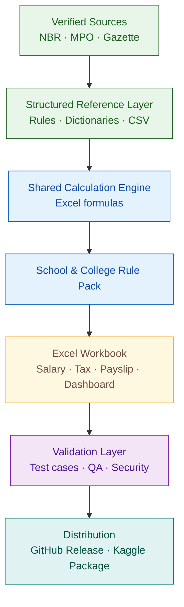

<p align="center">
  
</p>

<h1 align="center">Bangladesh MPO School & College Salary Tax Toolkit</h1>

<p align="center">
  <a href="#"></a>
  <a href="#"></a>
  <a href="#"></a>
  <a href="#"></a>
  <a href="#"></a>
  <a href="../../actions/workflows/portfolio-security.yml"></a>
</p>

<p align="center">
  <a href="LICENSE-CODE"></a>
  <a href="#"></a>
  <a href="#"></a>
  <a href="#"></a>
  <a href="#"></a>
  <a href="../../stargazers"></a>
  <a href="../../forks"></a>
  <a href="../../issues"></a>
  <a href="../../commits/main"></a>
  <a href="../../graphs/contributors"></a>
</p>

<p align="center">
  <a href="#-project-overview">Overview</a> ·
  <a href="#-workbook-modules">Workbook</a> ·
  <a href="#-repository-architecture">Architecture</a> ·
  <a href="#-repository-structure">Structure</a> ·
  <a href="data/csv/README.md">CSV Layer</a> ·
  <a href="docs/wiki/Home.md">Wiki Source</a> ·
  <a href="packages/kaggle/README.md">Kaggle Package</a>
</p>

<p align="center">
  An open-source, Excel-based toolkit for <strong>MPO-listed School & College employees in Bangladesh</strong><br>
  to prepare salary statements, tax estimates, payslips and personal-finance dashboards.
</p>

<p align="center"><strong>Project flow:</strong> verified rules → structured inputs → Excel calculation engine → formula tests → reporting outputs → release package.</p>

<h2 align="center">✨ Project overview</h2>

<p align="center">This repository turns Bangladesh MPO payroll and individual-tax rules into a structured, auditable Excel product.</p>

<table align="center" width="90%">
  <thead>
    <tr><th>Capability</th><th>Included</th></tr>
  </thead>
  <tbody>
    <tr><td>🧮 Salary calculation</td><td>Monthly basic salary, allowances, deductions and net pay</td></tr>
    <tr><td>🧾 Tax planning</td><td>Tax Year 2026–27 thresholds, slabs, minimum tax and TDS inputs</td></tr>
    <tr><td>👥 Taxpayer categories</td><td>Male, female, age 65+, third gender, disability and gazetted categories</td></tr>
    <tr><td>📊 Reporting</td><td>Annual statement, tax summary, dashboard and printable payslip</td></tr>
    <tr><td>✅ Validation</td><td>Deterministic formula scenarios, source register and verification status</td></tr>
    <tr><td>📁 Open data support</td><td>Reviewable CSV reference exports for Python, SQL and BI tools</td></tr>
    <tr><td>📚 Documentation</td><td>Version-controlled Wiki source under <code>docs/wiki/</code></td></tr>
    <tr><td>📦 Distribution</td><td>Separate Kaggle-ready package design under <code>packages/kaggle/</code></td></tr>
  </tbody>
</table>

<h2 align="center">🧰 Repository tools and governance</h2>

<table align="center" width="95%">
  <thead>
    <tr><th>Tool</th><th>Purpose</th><th>Open</th></tr>
  </thead>
  <tbody>
    <tr><td>Portfolio Security</td><td>Validates repository files, XLSX archives, CSV safety, immutable Actions and committed secrets</td><td><a href=".github/workflows/portfolio-security.yml">Workflow</a></td></tr>
    <tr><td>Repository policy</td><td>Workbook-focused validation script used by GitHub Actions</td><td><a href=".github/scripts/repository_policy.py">Validator</a></td></tr>
    <tr><td>Wiki Publisher</td><td>Synchronizes the authoritative <code>docs/wiki/</code> source to the separate GitHub Wiki repository</td><td><a href=".github/workflows/publish-wiki.yml">Workflow</a></td></tr>
    <tr><td>Dependabot</td><td>Maintains GitHub Actions dependencies on an Asia/Dhaka schedule</td><td><a href=".github/dependabot.yml">Configuration</a></td></tr>
    <tr><td>Workbook bug report</td><td>Structured form for formula, layout, source and compatibility defects</td><td><a href="../../issues/new?template=workbook-bug.yml">Open a bug report</a></td></tr>
    <tr><td>Pull-request checklist</td><td>Requires workbook, source, privacy and security validation</td><td><a href=".github/pull_request_template.md">Template</a></td></tr>
    <tr><td>Security policy</td><td>Defines private reporting, restricted data and workbook security controls</td><td><a href="SECURITY.md">Policy</a></td></tr>
  </tbody>
</table>

<h2 align="center">📌 Current release</h2>

<table align="center" width="70%">
  <thead>
    <tr><th>Item</th><th>Value</th></tr>
  </thead>
  <tbody>
    <tr><td>Product</td><td>Bangladesh MPO Salary & Tax Excel Toolkit</td></tr>
    <tr><td>First package</td><td>MPO School & College Salary and Tax</td></tr>
    <tr><td>Workbook</td><td><code>MPO_School_College_Salary_Tax_BD_TY2026_27.xlsx</code></td></tr>
    <tr><td>Version</td><td><code>v4.0</code></td></tr>
    <tr><td>Status</td><td>Beta</td></tr>
    <tr><td>Macro policy</td><td>No VBA in v1</td></tr>
    <tr><td>Compatibility target</td><td>Excel 2019 core formulas</td></tr>
  </tbody>
</table>

<h2 align="center">📊 Workbook modules</h2>

<table align="center" width="82%">
  <thead>
    <tr><th>Sheet</th><th>Purpose</th></tr>
  </thead>
  <tbody>
    <tr><td><code>START_HERE</code></td><td>User instructions and scope note</td></tr>
    <tr><td><code>PROJECT_CHARTER</code></td><td>Finalized project scope and release rules</td></tr>
    <tr><td><code>USER_INPUT</code></td><td>Salary, allowance, deduction and taxpayer inputs</td></tr>
    <tr><td><code>TAXPAYER_CATEGORIES</code></td><td>Male, female, 65+, disabled and special-category tax variation</td></tr>
    <tr><td><code>MONTHLY_SALARY</code></td><td>Month-by-month salary calculation</td></tr>
    <tr><td><code>ANNUAL_SALARY</code></td><td>Annual salary statement</td></tr>
    <tr><td><code>TAX_CALCULATION</code></td><td>Progressive tax estimate and minimum tax</td></tr>
    <tr><td><code>INCOME_EXPENSE</code></td><td>Expense allocation and surplus or deficit check</td></tr>
    <tr><td><code>DASHBOARD</code></td><td>KPI cards and charts</td></tr>
    <tr><td><code>PAYSLIP</code></td><td>Printable monthly payslip</td></tr>
    <tr><td><code>TAX_SUMMARY</code></td><td>Annual tax planning summary</td></tr>
    <tr><td><code>SOURCE_REGISTER</code></td><td>Rule evidence and verification status</td></tr>
    <tr><td><code>DATA_DICTIONARY</code></td><td>Field definitions and formula logic</td></tr>
    <tr><td><code>TEST_CASES</code></td><td>Deterministic formula-validation cases</td></tr>
  </tbody>
</table>

<h2 align="center">👥 Taxpayer category coverage</h2>

<p align="center">For Tax Year 2026–27, the workbook compares:</p>

<table align="center" width="72%">
  <thead>
    <tr><th>Category</th><th>Tax-free threshold</th></tr>
  </thead>
  <tbody>
    <tr><td>General male below 65</td><td align="right">BDT 400,000</td></tr>
    <tr><td>Female taxpayer or taxpayer aged 65+</td><td align="right">BDT 450,000</td></tr>
    <tr><td>Third-gender taxpayer or disabled individual</td><td align="right">BDT 525,000</td></tr>
    <tr><td>Eligible gazetted wounded freedom fighter or July fighter</td><td align="right">BDT 550,000</td></tr>
    <tr><td>Eligible disabled child or dependent</td><td align="right">Additional BDT 50,000</td></tr>
  </tbody>
</table>

<p align="center">Female status and age 65+ are not added together. The workbook treats them as the same higher-threshold class.</p>

<h2 align="center">🧱 Repository architecture</h2>



<p align="center">GitHub is the <strong>engineering workspace</strong>. Kaggle is the <strong>curated distribution workspace</strong>. The GitHub Wiki is a <strong>published copy</strong> of the authoritative Markdown under <code>docs/wiki/</code>.</p>

<h2 align="center">🗂️ Repository structure</h2>

```text
Bangladesh-MPO-School-College-Salary-Tax-Toolkit/
├── .github/                    # Workflows, policies and contribution templates
├── assets/
│   ├── brand/                  # Repository identity assets
│   └── previews/               # Stable workbook and release previews
├── data/
│   ├── csv/                    # Diff-friendly project reference exports
│   └── reference/              # Structured source and rule metadata
├── docs/
│   ├── governance/             # Release, security and maintenance guidance
│   ├── research/               # Project-specific rule research
│   ├── user-guides/            # Workbook usage guidance
│   └── wiki/                   # Authoritative GitHub Wiki source
├── excel/
│   ├── shared_engine/          # Reusable calculation-engine notes
│   └── school_college/         # School and College workbook package
├── notebooks/                  # Reproducible validation work
├── packages/
│   └── kaggle/                 # Curated distribution workspace
├── release/                    # Release notes and manifests
├── tests/                      # Formula-validation scenarios
├── CHANGELOG.md
├── CITATION.cff
├── CONTRIBUTING.md
├── LICENSE
├── README.md
└── SECURITY.md
```

<p align="center">See the complete responsibility map in <strong><a href="docs/REPOSITORY_STRUCTURE.md">Repository Structure</a></strong>.</p>

<h2 align="center">📁 CSV data layer</h2>

The `data/csv/` folder contains project-specific companion exports only. These files improve pull-request review and make selected tables usable in Python, SQL, Power BI, Tableau and similar tools without replacing the Excel workbook.

Current catalog:

- `01_taxpayer_categories_ty2026_27.csv`
- `02_salary_component_dictionary_ty2026_27.csv`
- `03_workbook_sheet_catalog_ty2026_27.csv`
- `04_validation_scenarios_ty2026_27.csv`
- `05_release_asset_manifest_ty2026_27.csv`

No employee-identifiable payroll, bank, national-ID or tax-return data belongs in this layer.

<h2 align="center">📚 Documentation and Wiki publishing</h2>

```text
Main repository
└── docs/wiki/                    authoritative, reviewable source

GitHub Wiki repository
└── *.md                          published copy
```

A root-level `/wiki/` folder is intentionally not used. The GitHub Wiki tab is backed by the separate `.wiki.git` repository. The controlled publishing workflow requires a repository secret named `WIKI_TOKEN` with suitable contents-write access.

<h2 align="center">✅ Verification status</h2>

This project remains **Beta** until:

- 20–30 deterministic formula tests pass;
- at least 10 anonymized official salary rows reconcile;
- every verified rule has a source ID and effective date;
- formula cells are protected for public release;
- MPO payroll and tax practitioners review the workbook.

<h2 align="center">🚧 Scope boundary</h2>

This repository does **not** mix in:

- Madrasa or Ebtedayi payroll;
- Technical or Vocational payroll;
- government or autonomous salary;
- private or NGO salary;
- VAT, TDS, import-export, LC or company-tax packages;
- HR analytics datasets, employee records or files from other projects.

Those subjects require separate packages and independently verified rule sets.

<h2 align="center">⚠️ Disclaimer</h2>

<p align="center">This workbook is an educational planning tool. It is not an official MPO bill, tax assessment, legal opinion or substitute for professional review.</p>

---

<h2 align="center">👤 Author & Maintainer</h2>

<div align="center">

### **Musa**

**Data Analytics · Excel Automation · Bangladesh Payroll & Tax Workflows**

*Research · Spreadsheet Engineering · Validation · Documentation · Release Maintenance*

</div>

<p align="center"><strong>Maintained by Musa</strong> as a data analytics and Excel automation portfolio project focused on making Bangladesh payroll and tax workflows more structured, auditable, reusable and easier to understand.</p>

<table align="center" width="75%">
  <tbody>
    <tr><td><strong>Portfolio focus</strong></td><td>Data analytics & Excel automation</td></tr>
    <tr><td><strong>Domain</strong></td><td>Bangladesh payroll & individual-tax workflows</td></tr>
    <tr><td><strong>Project contribution</strong></td><td>Research, workbook architecture, validation, documentation & release maintenance</td></tr>
    <tr><td><strong>Maintainer</strong></td><td><strong>Musa</strong></td></tr>
  </tbody>
</table>

<p align="center"><sub>Built as an open-source portfolio project for practical spreadsheet automation, transparent calculation workflows and reusable data-learning resources.</sub></p>

<h2 align="center">🤝 Project governance</h2>

<p align="center">
  <a href="CODE_OF_CONDUCT.md"><strong>Code of Conduct</strong></a>
  &nbsp;·&nbsp;
  <a href="LICENSE"><strong>License</strong></a>
  &nbsp;·&nbsp;
  <a href="LICENSE-CODE"><strong>MIT License</strong></a>
  &nbsp;·&nbsp;
  <a href="SECURITY.md"><strong>Security</strong></a>
</p>

<p align="center"><sub>Open-source portfolio project maintained for Bangladesh payroll, tax, Excel automation and data-learning workflows.</sub></p>
